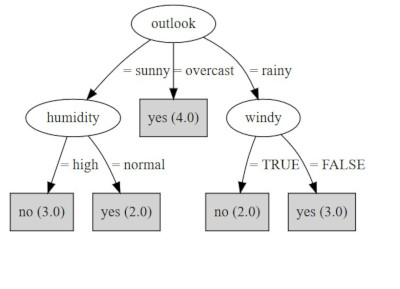

# Bot - Interpreter
Bot interpreter is a Node.js application able to use a decision tree, specified in JSON, to create a local RESTful chatbot application using the [Microsoft Bot Framework](https://dev.botframework.com/). It has been developed as part of a Bachelor Thesis project involving the creation of a classification chatbot. 

The application takes as input a JSON file that specifies the decision tree in the following format: 

`{label: “node1”, children: [{ edgeLabel: “to_node_2”, label: node_2 }, { edgeLabel: “to_node_3”, label: “node_3”, children […]  }]}`

The tree is specified in a recursive way, where each node, except the leafs, contains the list of its children nodes. Moreover, every node has a label attribute specifying its label/question and this property will be the one asked to the user during the conversation. All nodes (beside the root) have an edgeLabel property, which rapresents the label of the edge from the parent node and, in our case, also the answer to the parent's question that will determine the next node in the path. 

For a complete example of a decison tree specified in such a format, please have a look at the examples/test_tree.json file, which represent the following classification tree:

##Features

The application is a simple chatbot interpreter. It allows the traversal of a given decision tree, asking the user a question every time it reaches a new node. If the question is a categorical one and therefore the number of possible asnwers is fixed, the chatbot will send the question along with the options as clickable buttons.

On the other hand, if the question requires a numerical answer, the user is able to send freely every possible number as answer and the bot will then handle it appropriately. 

The application remembers every question and answer it has asked previously as a pair, in order to avoid asking multiple times the same question, if it appears more than once in the tree. In that case, the chatbot will use the previous stored value as answer. 

When a leaf node is reached, the application will send the user the final conclusion/value and then will terminate, dumping on the console window all question/answer pairs used in the conversation.

## Installation

Given its nature, Node.js is required. Moreover, the botbuilder and restify packages are required to create the local server and bot connection. All dependencies have already been specified in the package.json file, therefore you can follow this process to correctly install the application:

    1. Clone this repository or download the code as a compressed archive (and decompress it).
    2. Open a terminal or command prompt and, in the root folder of the project execute the dependency installation 
    command `npm install`

Furthermore, since the chatbot application will be created as a local RESTful service, you will need to connect to it in order to test it. A simple way of doing this is to install the [Bot Framework Emulator](https://github.com/Microsoft/BotFramework-Emulator/blob/master/README.md) and use it to connect to the local application.

## Usage

To start the bot interpreter, open a terminal window in the root folder of the project and execute the following command:
`node bot.js path_to_json_file` where path_to_json_file is the path to your json file specifying the decision tree.

For example, we can use one of the sample graphs provided with the tool and test our both using the following command:

`node bot.js test_tree.json`

## License

The code for this Node.js application is distributed under the MIT license, see the `LICENSE` file for more information. 